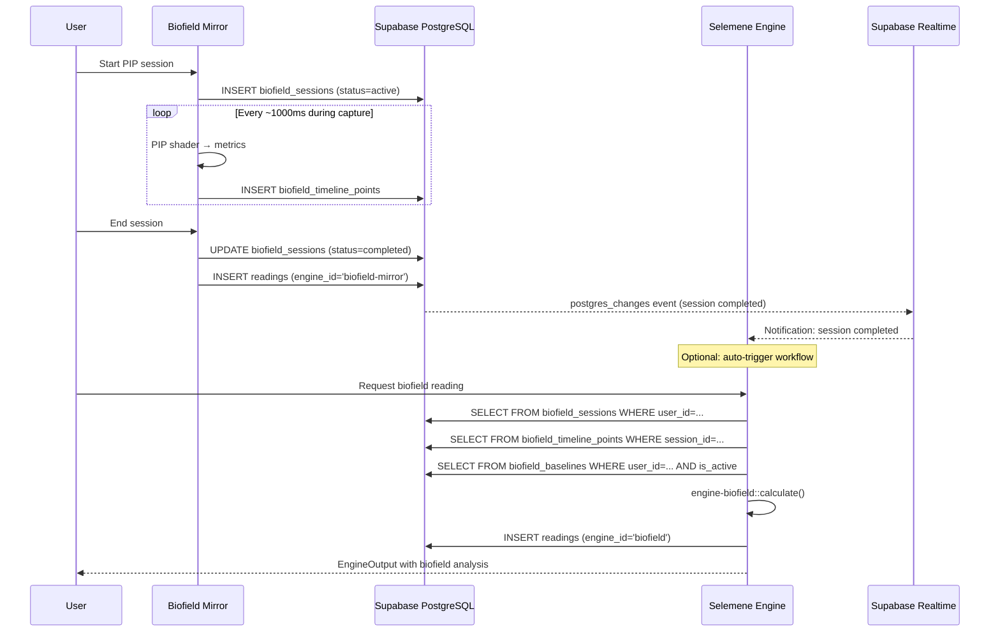
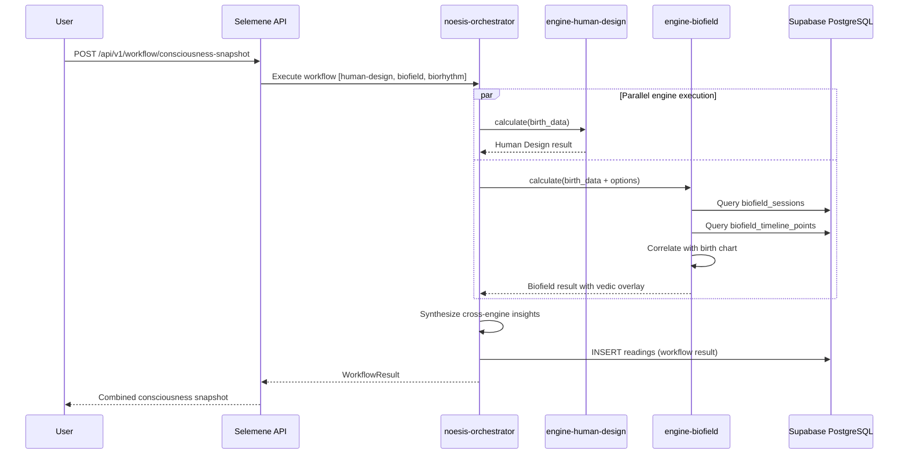
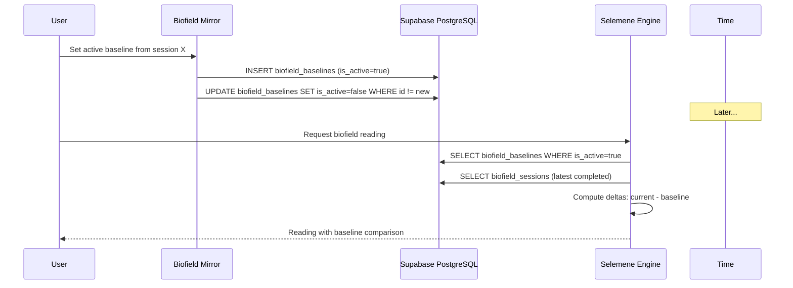

# Selemene Engine ↔ Biofield Mirror Integration Specification

> **GAP-008 / Issue #268**
> **Status**: Draft
> **Author**: Architect Agent
> **Date**: 2026-03-13
> **Selemene Supabase Ref**: `qjnqdhvlxdmezxdnlrbj` (selemene-engine-noesis)

---

## Table of Contents

1. [Executive Summary](#1-executive-summary)
2. [Architectural Context](#2-architectural-context)
3. [Integration Architecture — Decision](#3-integration-architecture--decision)
4. [User Mapping](#4-user-mapping)
5. [Data Contracts](#5-data-contracts)
6. [Sync Protocol](#6-sync-protocol)
7. [Supabase Realtime Integration](#7-supabase-realtime-integration)
8. [engine-biofield Crate Contract](#8-engine-biofield-crate-contract)
9. [Migration Plan](#9-migration-plan)
10. [Security Considerations](#10-security-considerations)
11. [Appendix: Sequence Diagrams](#11-appendix-sequence-diagrams)

---

## 1. Executive Summary

Biofield Mirror is a Tauri 2 desktop app that performs real-time biofield analysis
using PIP (Polycontrast Interference Photography) cameras. Selemene Engine is a
Rust-native consciousness analysis platform with 11+ engine crates (numerology,
human design, biorhythm, etc.), deployed as an Axum API service.

The `engine-biofield` crate inside Selemene is currently a **stub returning mock
data**. This specification defines how it becomes a **live consumer of Biofield
Mirror's real analysis data**, enabling cross-engine correlation (e.g., "How does
your biofield coherence shift during a Saturn return?").

### Fundamental Constraint

Both systems already share the same Supabase project (`qjnqdhvlxdmezxdnlrbj`).
Biofield Mirror's bootstrap migration (`20260308173000_selene_compat_bootstrap.sql`)
creates local stubs of Selemene's core tables (`users`, `readings`,
`user_profiles`, `progression_logs`) — in production, these tables are Selemene's.
Biofield Mirror writes readings with `engine_id = 'biofield-mirror'`.

**This means the integration path already exists.** The work is formalizing the
contract and removing the mock from `engine-biofield`.

---

## 2. Architectural Context

### 2.1 Biofield Mirror Stack

```
┌─────────────────────────────────────────────┐
│  Tauri 2 Desktop App                        │
│  ┌──────────────┐  ┌────────────────────┐   │
│  │ React 19 +   │  │ src-tauri/         │   │
│  │ Vite Frontend│  │ Rust Compute (IPC) │   │
│  │              │  │                    │   │
│  │ WebGL PIP    │  │ [planned compute   │   │
│  │ Shader       │  │  engine]           │   │
│  └──────┬───────┘  └────────────────────┘   │
│         │                                   │
│         ▼                                   │
│  ┌──────────────┐                           │
│  │ FastAPI       │                          │
│  │ Backend       │ Sessions, Snapshots,     │
│  │ (Python)      │ Timelines, Baselines,    │
│  │               │ Readings persistence     │
│  └──────┬────────┘                          │
└─────────┼───────────────────────────────────┘
          │
          ▼
┌─────────────────────────┐
│ Supabase PostgreSQL     │
│ (qjnqdhvlxdmezxdnlrbj) │
│                         │
│ • users                 │  ← Selemene-owned
│ • user_profiles         │  ← Selemene-owned
│ • readings              │  ← Selemene-owned, Biofield writes here
│ • progression_logs      │  ← Selemene-owned
│ • biofield_sessions     │  ← Biofield-owned
│ • biofield_snapshots    │  ← Biofield-owned
│ • biofield_timeline_pts │  ← Biofield-owned
│ • biofield_baselines    │  ← Biofield-owned
│ • biofield_artifacts    │  ← Biofield-owned
└─────────────────────────┘
```

### 2.2 Selemene Engine Stack

```
┌──────────────────────────────────────────────────┐
│  Selemene Engine (Rust, Axum)                    │
│                                                  │
│  crates/noesis-api      → HTTP API gateway       │
│  crates/noesis-auth     → Supabase JWT verify    │
│  crates/noesis-data     → sqlx PostgreSQL models │
│  crates/noesis-core     → ConsciousnessEngine    │
│  crates/noesis-orchestrator → Multi-engine runs  │
│  crates/noesis-cache    → Redis/DashMap cache    │
│                                                  │
│  Engine Crates:                                  │
│  ├── engine-panchanga                            │
│  ├── engine-numerology                           │
│  ├── engine-biorhythm                            │
│  ├── engine-human-design                         │
│  ├── engine-gene-keys                            │
│  ├── engine-vimshottari                          │
│  ├── engine-vedic-clock                          │
│  ├── engine-biofield     ← THIS IS THE TARGET   │
│  ├── engine-face-reading                         │
│  ├── engine-nadabrahman                          │
│  └── engine-transits                             │
│                                                  │
│  Connection: sqlx → same Supabase PostgreSQL     │
└──────────────────────────────────────────────────┘
```

### 2.3 Shared Infrastructure

| Resource | Owner | Both Access? |
|----------|-------|-------------|
| Supabase PostgreSQL | Selemene project | **Yes** — same DB |
| Supabase Auth | Selemene project | **Yes** — same JWT issuer |
| Supabase Storage | Selemene project | Biofield: `biofield-captures`, `biofield-reports` |
| Supabase Realtime | Selemene project | Available to both |

---

## 3. Integration Architecture — Decision

### 3.1 Options Evaluated

| Option | Description | Pros | Cons |
|--------|-------------|------|------|
| **A: Shared Database** | Both read/write same Supabase tables | Zero-latency reads, no new infra, already partially implemented | Schema coupling, migration coordination required |
| B: API-to-API | Selemene exposes gRPC/REST, Biofield calls it | Clean separation, versioned contracts | New network hop, authentication complexity, deployment coupling |
| C: Realtime Events | Supabase Realtime pub/sub between systems | Loose coupling, event-driven | Eventually consistent, complex error handling, debugging opacity |

### 3.2 Recommendation: **Option A (Shared Database) + Option C (Realtime) for Notifications**

**Primary justification**: The shared database already exists. Both systems write
to the same Supabase PostgreSQL instance. Adding an API layer between them would
mean serializing data out of PostgreSQL only to deserialize it and query
PostgreSQL again — a net negative.

**Architectural principles applied:**

1. **Fundamental constraints first** — Both systems are already co-tenants on the
   same database. The network boundary doesn't exist. Don't create one artificially.

2. **Simplicity** — Zero new services to deploy, zero new authentication flows.
   Selemene's `engine-biofield` directly queries `biofield_*` tables via sqlx.

3. **Ownership boundaries preserved** — Biofield Mirror WRITES to `biofield_*`
   tables. Selemene's `engine-biofield` READS them. The `readings` table is
   Selemene-owned — Biofield Mirror writes readings there as a guest, using
   `engine_id = 'biofield-mirror'`.

4. **Realtime for coordination** — When Biofield Mirror completes a session, it
   publishes a Supabase Realtime event. Selemene can optionally subscribe for
   cross-engine correlation triggers.

### 3.3 Boundary Rules

```
┌─────────────────────────────────────────────────────────────────────┐
│                        WRITE OWNERSHIP                              │
│                                                                     │
│  Biofield Mirror WRITES:          Selemene Engine WRITES:           │
│  ├── biofield_sessions            ├── readings (engine_id != BM)    │
│  ├── biofield_snapshots           ├── users                         │
│  ├── biofield_timeline_points     ├── user_profiles                 │
│  ├── biofield_baselines           ├── progression_logs              │
│  ├── biofield_artifacts           └── (engine-specific tables)      │
│  └── readings (engine_id =                                          │
│       'biofield-mirror')                                            │
│                                                                     │
│  Cross-read permissions:                                            │
│  ├── Selemene READS biofield_* (read-only, via sqlx)                │
│  └── Biofield Mirror READS user_profiles (for birth data display)   │
└─────────────────────────────────────────────────────────────────────┘
```

---

## 4. User Mapping

### 4.1 Identity Model

Both systems use **Supabase Auth**. The same `auth.users` table is the identity
source of truth. The `user_id` (UUID) in every `biofield_*` table is the same
UUID that appears in Selemene's `users.id` and `user_profiles.user_id`.

```
auth.users.id  ←→  public.users.id  ←→  biofield_sessions.user_id
      │                   │                       │
      │                   │                       │
      ▼                   ▼                       ▼
   JWT sub claim    Selemene user record    Biofield session owner
```

**No mapping table is required.** The foreign key chain is:

```sql
biofield_sessions.user_id → public.users.id  -- already exists
readings.user_id          → public.users.id  -- already exists
```

### 4.2 Cross-System Session Correlation

When Selemene runs a multi-engine workflow that includes `engine-biofield`, it
needs to know which Biofield Mirror session to reference. Two approaches:

**Approach 1 — Latest Session (Default)**
```sql
-- engine-biofield queries the user's most recent completed session
SELECT * FROM biofield_sessions
WHERE user_id = $1
  AND status = 'completed'
ORDER BY ended_at DESC
LIMIT 1;
```

**Approach 2 — Explicit Session ID (Workflow Option)**
```json
{
  "engine_id": "biofield",
  "options": {
    "biofield_session_id": "uuid-of-specific-session"
  }
}
```

Both are supported. The `EngineInput.options` HashMap in `noesis-core` already
accommodates engine-specific parameters.

### 4.3 RLS Compatibility

All `biofield_*` tables enforce `auth.uid() = user_id`. Selemene's API server
authenticates via the same Supabase JWT, so the same RLS policies apply:

- Selemene API receives user's JWT → extracts `sub` claim → sets
  `request.jwt.claims` on the PostgreSQL connection
- sqlx queries against `biofield_*` tables respect RLS automatically
- **No service-role bypass is needed** — each user's request only sees their own data

---

## 5. Data Contracts

### 5.1 Score Vector — The Canonical Bridge Type

The central data exchange format is the **ScoreVector**. Both systems already use
this structure (Biofield Mirror calls it `CompositeScores`).

#### TypeScript (Biofield Mirror Frontend)

```typescript
/** Canonical composite score vector — 6 dimensions, 0-100 each */
export interface ScoreVector {
  energy: number;       // Overall field energy intensity
  symmetry: number;     // Left-right field balance
  coherence: number;    // Interference pattern alignment
  complexity: number;   // Fractal dimension of pattern
  regulation: number;   // Temporal stability index
  colorBalance: number; // Spectral distribution evenness
}
```

#### Python (Biofield Mirror Backend)

```python
class ScoreVector(BaseModel):
    energy: float = Field(ge=0, le=100)
    symmetry: float = Field(ge=0, le=100)
    coherence: float = Field(ge=0, le=100)
    complexity: float = Field(ge=0, le=100)
    regulation: float = Field(ge=0, le=100)
    colorBalance: float = Field(ge=0, le=100)
```

#### Rust (engine-biofield in Selemene)

```rust
/// Canonical composite score vector — the bridge type between
/// Biofield Mirror and Selemene's engine-biofield crate.
#[derive(Debug, Clone, Serialize, Deserialize)]
pub struct ScoreVector {
    /// Overall field energy intensity (0.0–100.0)
    pub energy: f64,
    /// Left-right field balance (0.0–100.0)
    pub symmetry: f64,
    /// Interference pattern alignment (0.0–100.0)
    pub coherence: f64,
    /// Fractal dimension of pattern (0.0–100.0)
    pub complexity: f64,
    /// Temporal stability index (0.0–100.0)
    pub regulation: f64,
    /// Spectral distribution evenness (0.0–100.0)
    #[serde(rename = "colorBalance")]
    pub color_balance: f64,
}
```

### 5.2 Metric Vector — Raw Measurements

The raw metric vector from PIP analysis. Stored in
`biofield_timeline_points.metric_vector` as JSONB.

#### TypeScript

```typescript
/** Raw PIP analysis metrics from WebGL shader output */
export interface MetricVector {
  avgIntensity: number;
  intensityStdDev: number;
  maxIntensity: number;
  minIntensity: number;
  lightQuantaDensity: number;
  normalizedArea: number;
  innerNoise: number;
  innerNoisePercent: number;
  horizontalSymmetry: number;
  verticalSymmetry: number;
  dominantHue: number;
  saturationMean: number;
  colorEntropy: number;
  frameToFrameChange: number;
}
```

#### Rust

```rust
/// Raw PIP analysis metrics from the Biofield Mirror shader pipeline.
/// Read from `biofield_timeline_points.metric_vector` JSONB.
#[derive(Debug, Clone, Serialize, Deserialize)]
#[serde(rename_all = "camelCase")]
pub struct MetricVector {
    pub avg_intensity: f64,
    pub intensity_std_dev: f64,
    pub max_intensity: f64,
    pub min_intensity: f64,
    pub light_quanta_density: f64,
    pub normalized_area: f64,
    pub inner_noise: f64,
    pub inner_noise_percent: f64,
    pub horizontal_symmetry: f64,
    pub vertical_symmetry: f64,
    pub dominant_hue: f64,
    pub saturation_mean: f64,
    pub color_entropy: f64,
    pub frame_to_frame_change: f64,
}
```

### 5.3 Session Lifecycle Events

Biofield Mirror manages session lifecycle via its FastAPI backend. The canonical
session states are stored in `biofield_sessions.status`:

```
  ┌─────────┐     pause      ┌────────┐     resume    ┌────────┐
  │  active  │ ──────────────►│ paused │ ─────────────►│ active │
  └────┬─────┘               └────┬────┘               └───┬────┘
       │                          │                        │
       │ end                      │ abort                  │ end
       ▼                          ▼                        ▼
  ┌───────────┐            ┌──────────┐             ┌───────────┐
  │ completed │            │ aborted  │             │ completed │
  └───────────┘            └──────────┘             └───────────┘
```

#### Session Record (from biofield_sessions)

```typescript
/** Persisted session record as stored in Supabase */
export interface BiofieldSession {
  id: string;                          // UUID
  user_id: string;                     // UUID → auth.users.id
  status: 'active' | 'paused' | 'completed' | 'aborted';
  analysis_mode: 'fullBody' | 'face' | 'segmented';
  analysis_region: 'full' | 'face' | 'body';
  source_kind: SourceKind;
  summary_reading_id: string | null;   // UUID → readings.id
  latest_snapshot_id: string | null;   // UUID → biofield_snapshots.id
  started_at: string;                  // ISO 8601 timestamp
  paused_at: string | null;
  ended_at: string | null;
  duration_seconds: number | null;
  score_recipe_version: string;        // e.g., "v1"
  metric_recipe_version: string;       // e.g., "v1"
  metadata: Record<string, unknown>;   // JSONB bag
  created_at: string;
  updated_at: string;
}

type SourceKind = 'live-estimate' | 'backend-detailed' | 'python-engine' | 'rust-engine';
```

### 5.4 Timeline Data Point

```typescript
/** One sample in a session's time series — stored in biofield_timeline_points */
export interface TimelinePoint {
  id: string;
  session_id: string;
  user_id: string;
  sample_index: number;                // 0-based monotonically increasing
  sample_time_ms: number;              // Milliseconds since session start
  score_vector: ScoreVector;           // JSONB
  metric_vector: MetricVector;         // JSONB
  source_kind: SourceKind;
  score_recipe_version: string;
  metric_recipe_version: string;
  created_at: string;
}
```

### 5.5 Snapshot Payload

```typescript
/** A user-initiated or automatic capture point within a session */
export interface BiofieldSnapshot {
  id: string;
  user_id: string;
  session_id: string | null;
  reading_id: string | null;           // → readings.id (full analysis result)
  label: string | null;                // User-editable label
  capture_mode: 'manual' | 'auto' | 'baseline-source';
  analysis_region: 'full' | 'face' | 'body';
  source_kind: SourceKind;
  original_artifact_id: string | null; // → biofield_artifacts.id
  processed_artifact_id: string | null;
  captured_at: string;
  metadata: Record<string, unknown>;
  created_at: string;
  updated_at: string;
}
```

### 5.6 Baseline Comparison Request/Response

```typescript
/** Request to compare a session or snapshot against a baseline */
export interface BaselineComparisonRequest {
  user_id: string;
  baseline_id?: string;               // Specific baseline, or null for active
  compare_session_id?: string;         // Session to compare
  compare_snapshot_id?: string;        // Or snapshot to compare
}

/** Comparison result with deltas */
export interface BaselineComparisonResult {
  baseline: {
    id: string;
    name: string | null;
    scores: ScoreVector;
    created_at: string;
  };
  current: {
    source_type: 'session' | 'snapshot';
    source_id: string;
    scores: ScoreVector;
  };
  deltas: {
    energy: number;                    // current - baseline
    symmetry: number;
    coherence: number;
    complexity: number;
    regulation: number;
    colorBalance: number;
  };
  improvement_pct: number;             // Weighted composite improvement %
}
```

### 5.7 Readings Record (Selemene-Owned)

When Biofield Mirror persists a full analysis, it writes to the shared `readings`
table with this contract:

```typescript
/** Reading record written by Biofield Mirror to Selemene's readings table */
export interface BiofieldReading {
  id: string;
  user_id: string;
  engine_id: 'biofield-mirror';        // Fixed discriminator
  workflow_id: string;                  // e.g., 'live-capture', 'backend-detailed'
  input_hash: string;                   // SHA-256 of input_data
  input_data: {
    session_id?: string;
    snapshot_id?: string;
    analysis_mode: 'fullBody' | 'face' | 'segmented';
    analysis_region: 'full' | 'face' | 'body';
    pip_settings: Record<string, unknown>;
    capture_context: Record<string, unknown>;
    provenance: {
      source_kind: SourceKind;
      engine_id: string;
      workflow_id: string;
      analysis_mode: string;
      analysis_region: string;
      score_recipe_version: string;
      metric_recipe_version: string;
      runtime_route: string;
      app_version?: string;
    };
  };
  result_data: {
    scores: ScoreVector;
    metrics: Record<string, unknown>;
    metric_groups: Record<string, Record<string, unknown>>;
    artifact_refs: Record<string, unknown>;
    comparisons: Record<string, unknown>;
    provenance: { /* same as input_data.provenance */ };
  };
  witness_prompt?: string;
  consciousness_level?: number;
  calculation_time_ms?: number;
  created_at: string;
}
```

---

## 6. Sync Protocol

### 6.1 Data Flow Topology

```
┌───────────────────────┐         ┌──────────────────────┐
│   Biofield Mirror     │         │   Selemene Engine     │
│   (Desktop App)       │         │   (API Server)        │
│                       │         │                       │
│  PIP Camera → Shader  │         │  engine-biofield      │
│       │               │         │       │               │
│       ▼               │         │       ▼               │
│  FastAPI Backend      │         │  sqlx queries         │
│       │               │  READ   │       │               │
│       ▼               │◄────────│       │               │
│  Supabase PostgreSQL ─┼─────────┼───────┘               │
│  (biofield_* tables)  │         │                       │
│       │               │         │                       │
│       ▼               │ NOTIFY  │       ▲               │
│  Supabase Realtime   ─┼─────────┼───────┘               │
│  (optional events)    │         │  (subscription)       │
└───────────────────────┘         └──────────────────────┘
```

### 6.2 Real-Time Data Flow (During Active Sessions)

**During an active session**, Biofield Mirror writes timeline points every ~1000ms
to `biofield_timeline_points`. This is a high-frequency INSERT workload.

**Selemene does NOT read in real-time during capture.** It reads **after session
completion** for analysis. Real-time monitoring is Biofield Mirror's
responsibility.

Rationale: Selemene's engines run on-demand (user requests a reading) or in
scheduled workflows. Trying to stream timeline data to Selemene during capture
would add latency without benefit — the analysis requires the complete session.

### 6.3 Batch Read Flow (engine-biofield Queries)

When Selemene's orchestrator invokes the `engine-biofield` crate:

```
1. User requests workflow via Selemene API
   POST /api/v1/calculate
   { "engine_id": "biofield", "birth_data": {...}, "options": {...} }

2. noesis-orchestrator routes to engine-biofield

3. engine-biofield::calculate() executes:
   a. Read latest completed session for user_id
   b. Read session's timeline_points (aggregate)
   c. Read session's snapshots (if any)
   d. Read active baseline (if exists)
   e. Compute cross-engine correlations using birth_data + biofield data
   f. Generate witness prompt
   g. Return EngineOutput

4. Result stored in readings table (engine_id = 'biofield')
```

### 6.4 Conflict Resolution

**Write ownership eliminates conflicts.** Since:
- Only Biofield Mirror writes to `biofield_*` tables
- Only Selemene's other engines write readings with their own `engine_id`
- The shared `readings` table uses UUID primary keys with no upsert conflicts

There are no write-write conflicts by design. The `engine_id` column in
`readings` acts as a namespace:

| engine_id | Writer |
|-----------|--------|
| `biofield-mirror` | Biofield Mirror backend |
| `biofield` | Selemene's engine-biofield crate |
| `panchanga` | Selemene's engine-panchanga |
| `numerology` | Selemene's engine-numerology |
| ... | ... |

### 6.5 Offline-First Considerations (Tauri Desktop)

Biofield Mirror runs as a Tauri 2 desktop app. When offline:

1. **Local capture continues** — PIP analysis happens in the WebGL shader, no
   network required
2. **Timeline points queue locally** — The FastAPI backend can buffer writes
3. **On reconnection** — Buffered writes replay to Supabase
4. **Selemene engine-biofield** — Only sees data once it reaches Supabase. No
   special handling needed on Selemene's side. A query for the user's latest
   session will simply return the last synced session.

**No sync conflict** arises because Biofield Mirror is the sole writer.

### 6.6 Historical Session Sync

For the initial integration or re-sync scenarios:

```sql
-- Selemene can query all historical sessions for a user
SELECT s.*, 
       count(tp.id) as point_count,
       max(tp.sample_time_ms) as max_sample_time
FROM biofield_sessions s
LEFT JOIN biofield_timeline_points tp ON tp.session_id = s.id
WHERE s.user_id = $1
  AND s.status = 'completed'
GROUP BY s.id
ORDER BY s.ended_at DESC;
```

No separate sync mechanism is needed — it's just a SQL query.

---

## 7. Supabase Realtime Integration

### 7.1 Purpose

Supabase Realtime is used for **optional coordination events**, not for data
transfer. The data is already in the shared database.

### 7.2 Channel Design

```
Channel: biofield:{user_id}
Purpose: Notify Selemene that new biofield data is available

Events:
  ├── session.completed   → A session finished, full data available
  ├── snapshot.created    → A new snapshot was captured
  ├── baseline.updated    → User's active baseline changed
  └── reading.created     → A new biofield reading was persisted
```

### 7.3 Database Change Subscription

Using Supabase Realtime's Postgres Changes:

```typescript
// Selemene-side subscription (if implementing real-time triggers)
const channel = supabase
  .channel('biofield-changes')
  .on(
    'postgres_changes',
    {
      event: 'UPDATE',
      schema: 'public',
      table: 'biofield_sessions',
      filter: `status=eq.completed`
    },
    (payload) => {
      // Trigger cross-engine correlation workflow
      triggerBiofieldWorkflow(payload.new.user_id, payload.new.id);
    }
  )
  .subscribe();
```

### 7.4 Tables to Subscribe To

| Table | Event | Trigger |
|-------|-------|---------|
| `biofield_sessions` | UPDATE (status → completed) | Cross-engine workflow |
| `biofield_baselines` | INSERT/UPDATE (is_active = true) | Recalculate comparisons |
| `readings` | INSERT (engine_id = 'biofield-mirror') | Update engine-biofield cache |

### 7.5 RLS Implications

Supabase Realtime respects RLS policies. Since all `biofield_*` tables have
`auth.uid() = user_id` policies:

- **Server-side subscriptions** (Selemene API) — Must use the service role key
  or set the user's JWT on the Realtime connection
- **Client-side subscriptions** (if Biofield Mirror frontend subscribes) —
  Automatically scoped to the authenticated user

**Recommendation**: Selemene should subscribe using a **service role connection**
with explicit `user_id` filtering in the application layer, since it processes
multiple users' data server-side.

### 7.6 Channel Naming Convention

```
Pattern:  biofield:{user_id}:{event_category}
Examples:
  biofield:550e8400-e29b-41d4-a716-446655440000:sessions
  biofield:550e8400-e29b-41d4-a716-446655440000:readings
```

For server-side (Selemene API), a single wildcard subscription with application-
level routing is more efficient:

```
Channel: biofield-engine-events
Filter:  table = 'biofield_sessions' AND status = 'completed'
```

---

## 8. engine-biofield Crate Contract

### 8.1 Current State (Stub)

The existing `engine-biofield` crate implements `ConsciousnessEngine` but returns
mock data via `generate_mock_metrics()`. It has:

- `BiofieldEngine` struct implementing `ConsciousnessEngine`
- `BiofieldMetrics` with fractal_dimension, entropy, coherence, symmetry, etc.
- `ChakraReading` with 7 chakras
- Vedic birth-data correlation (basic)
- Witness prompt generation

### 8.2 Target State — Live Data Consumer

```rust
// crates/engine-biofield/src/lib.rs (updated exports)

pub mod engine;
pub mod models;         // BiofieldMetrics, ChakraReading (existing)
pub mod mirror;         // NEW: Biofield Mirror data access
pub mod correlation;    // NEW: Cross-engine correlation logic
pub mod vedic;          // Existing vedic integration
pub mod wisdom;         // Existing wisdom/interpretation
pub mod witness;        // Existing witness prompts

// Re-exports
pub use engine::BiofieldEngine;
pub use mirror::{MirrorClient, MirrorSession, ScoreVector, MetricVector};
pub use models::{BiofieldAnalysis, BiofieldMetrics, Chakra, ChakraReading};
```

### 8.3 New Trait: BiofieldMirrorProvider

```rust
use async_trait::async_trait;
use chrono::{DateTime, Utc};
use uuid::Uuid;

/// Trait for accessing Biofield Mirror data from the shared database.
/// 
/// Implementations:
/// - `SqlxMirrorProvider` (production, queries Supabase PostgreSQL)
/// - `MockMirrorProvider` (testing, returns synthetic data)
#[async_trait]
pub trait BiofieldMirrorProvider: Send + Sync {
    /// Fetch the user's most recent completed session with summary stats.
    async fn latest_session(
        &self,
        user_id: Uuid,
    ) -> Result<Option<MirrorSession>, BiofieldMirrorError>;

    /// Fetch a specific session by ID (must belong to user_id).
    async fn session_by_id(
        &self,
        user_id: Uuid,
        session_id: Uuid,
    ) -> Result<Option<MirrorSession>, BiofieldMirrorError>;

    /// Fetch timeline points for a session, optionally windowed.
    async fn timeline_points(
        &self,
        session_id: Uuid,
        window: Option<TimeWindow>,
    ) -> Result<Vec<MirrorTimelinePoint>, BiofieldMirrorError>;

    /// Fetch the user's active baseline, if any.
    async fn active_baseline(
        &self,
        user_id: Uuid,
    ) -> Result<Option<MirrorBaseline>, BiofieldMirrorError>;

    /// Fetch session statistics: score aggregates over the timeline.
    async fn session_statistics(
        &self,
        session_id: Uuid,
    ) -> Result<SessionStatistics, BiofieldMirrorError>;
}

/// Time window for querying timeline subsets
#[derive(Debug, Clone)]
pub struct TimeWindow {
    pub start_ms: i64,
    pub end_ms: i64,
}
```

### 8.4 Mirror Data Types (Rust)

```rust
use chrono::{DateTime, Utc};
use serde::{Deserialize, Serialize};
use uuid::Uuid;

/// A completed Biofield Mirror session, read from biofield_sessions
#[derive(Debug, Clone, Serialize, Deserialize)]
pub struct MirrorSession {
    pub id: Uuid,
    pub user_id: Uuid,
    pub status: String,
    pub analysis_mode: String,
    pub analysis_region: String,
    pub source_kind: String,
    pub summary_reading_id: Option<Uuid>,
    pub latest_snapshot_id: Option<Uuid>,
    pub started_at: DateTime<Utc>,
    pub ended_at: Option<DateTime<Utc>>,
    pub duration_seconds: Option<i32>,
    pub score_recipe_version: String,
    pub metric_recipe_version: String,
    pub metadata: serde_json::Value,
}

/// A single timeline sample, read from biofield_timeline_points
#[derive(Debug, Clone, Serialize, Deserialize)]
pub struct MirrorTimelinePoint {
    pub id: Uuid,
    pub session_id: Uuid,
    pub sample_index: i32,
    pub sample_time_ms: i32,
    pub score_vector: ScoreVector,
    pub metric_vector: serde_json::Value, // Flexible for forward compat
    pub source_kind: String,
}

/// User's baseline for comparison
#[derive(Debug, Clone, Serialize, Deserialize)]
pub struct MirrorBaseline {
    pub id: Uuid,
    pub user_id: Uuid,
    pub name: Option<String>,
    pub is_active: bool,
    pub baseline_scores: ScoreVector,
    pub baseline_metrics: serde_json::Value,
    pub source_session_id: Option<Uuid>,
    pub created_at: DateTime<Utc>,
}

/// Aggregate statistics over a session's timeline
#[derive(Debug, Clone, Serialize, Deserialize)]
pub struct SessionStatistics {
    pub session_id: Uuid,
    pub point_count: i64,
    pub duration_ms: i64,
    pub avg_scores: ScoreVector,
    pub min_scores: ScoreVector,
    pub max_scores: ScoreVector,
    pub score_trend: ScoreTrend,
    pub dominant_element: String,
    pub coherence_stability: f64,  // std_dev of coherence over time
}

/// Direction of score movement over session duration
#[derive(Debug, Clone, Serialize, Deserialize)]
pub struct ScoreTrend {
    pub energy: TrendDirection,
    pub symmetry: TrendDirection,
    pub coherence: TrendDirection,
    pub complexity: TrendDirection,
    pub regulation: TrendDirection,
    pub color_balance: TrendDirection,
}

#[derive(Debug, Clone, Copy, Serialize, Deserialize)]
pub enum TrendDirection {
    Rising,
    Falling,
    Stable,
    Oscillating,
}
```

### 8.5 ScoreVector ↔ BiofieldMetrics Bridge

The existing `BiofieldMetrics` type uses different field names than Biofield
Mirror's `ScoreVector`. The bridge function:

```rust
impl ScoreVector {
    /// Convert Biofield Mirror's ScoreVector into Selemene's BiofieldMetrics
    pub fn to_biofield_metrics(&self, timestamp: DateTime<Utc>) -> BiofieldMetrics {
        BiofieldMetrics {
            fractal_dimension: self.complexity / 100.0 * 1.0 + 1.0, // Map 0-100 → 1.0-2.0
            entropy: self.color_balance / 100.0,                      // Map 0-100 → 0.0-1.0
            coherence: self.coherence / 100.0,                        // Map 0-100 → 0.0-1.0
            symmetry: self.symmetry / 100.0,                          // Map 0-100 → 0.0-1.0
            vitality_index: self.energy / 100.0,                      // Map 0-100 → 0.0-1.0
            chakra_readings: vec![],                                   // Derived separately
            timestamp,
        }
    }

    /// Create ScoreVector from BiofieldMetrics (reverse bridge)
    pub fn from_biofield_metrics(m: &BiofieldMetrics) -> Self {
        Self {
            energy: m.vitality_index * 100.0,
            symmetry: m.symmetry * 100.0,
            coherence: m.coherence * 100.0,
            complexity: (m.fractal_dimension - 1.0) * 100.0,
            regulation: 0.0, // No direct equivalent in BiofieldMetrics
            color_balance: m.entropy * 100.0,
        }
    }
}
```

### 8.6 Updated ConsciousnessEngine Implementation

```rust
use async_trait::async_trait;
use noesis_core::{
    ConsciousnessEngine, EngineError, EngineInput, EngineOutput,
    CalculationMetadata, ValidationResult,
};

pub struct BiofieldEngine {
    /// Provider for reading Biofield Mirror data from Supabase
    mirror: Box<dyn BiofieldMirrorProvider>,
}

impl BiofieldEngine {
    /// Create with a live Supabase connection
    pub fn new(mirror: Box<dyn BiofieldMirrorProvider>) -> Self {
        Self { mirror }
    }

    /// Create with mock provider (backward compatible)
    pub fn new_mock() -> Self {
        Self {
            mirror: Box::new(MockMirrorProvider::default()),
        }
    }
}

#[async_trait]
impl ConsciousnessEngine for BiofieldEngine {
    fn engine_id(&self) -> &str { "biofield" }
    fn engine_name(&self) -> &str { "Biofield Analysis" }
    fn required_phase(&self) -> u8 { 0 }

    async fn calculate(&self, input: EngineInput) -> Result<EngineOutput, EngineError> {
        let user_id = extract_user_id(&input)?;
        let start = std::time::Instant::now();

        // Determine which session to analyze
        let session = match input.options.get("biofield_session_id") {
            Some(sid) => {
                let sid: Uuid = serde_json::from_value(sid.clone())
                    .map_err(|e| EngineError::InvalidInput(e.to_string()))?;
                self.mirror.session_by_id(user_id, sid).await?
            }
            None => self.mirror.latest_session(user_id).await?,
        };

        let session = match session {
            Some(s) => s,
            None => {
                // No Biofield Mirror data — fall back to birth-data analysis
                return self.calculate_from_birth_data(&input, start).await;
            }
        };

        // Read session data
        let stats = self.mirror.session_statistics(session.id).await?;
        let baseline = self.mirror.active_baseline(user_id).await?;

        // Build result combining Mirror data with vedic correlations
        let biofield_metrics = stats.avg_scores.to_biofield_metrics(input.current_time);
        let vedic_overlay = if input.birth_data.is_some() {
            Some(self.calculate_vedic_overlay(&input, &stats)?)
        } else {
            None
        };

        let result = self.build_result(&biofield_metrics, &stats, &baseline, &vedic_overlay);
        let witness = generate_witness_prompt(&biofield_metrics, &input);

        Ok(EngineOutput {
            engine_id: "biofield".to_string(),
            result,
            witness_prompt: witness,
            consciousness_level: input.options
                .get("consciousness_level")
                .and_then(|v| v.as_u64())
                .unwrap_or(0) as u8,
            metadata: CalculationMetadata {
                calculation_time_ms: start.elapsed().as_secs_f64() * 1000.0,
                backend: "biofield-mirror-live".to_string(),
                precision_achieved: "standard".to_string(),
                cached: false,
                timestamp: chrono::Utc::now(),
                engine_version: env!("CARGO_PKG_VERSION").to_string(),
            },
        })
    }

    async fn validate(&self, output: &EngineOutput) -> Result<ValidationResult, EngineError> {
        // Validate score ranges are within 0-100
        let result = &output.result;
        let valid = result.get("scores")
            .map(|s| {
                s.as_object()
                    .map(|obj| obj.values().all(|v| {
                        v.as_f64().map(|n| (0.0..=100.0).contains(&n)).unwrap_or(false)
                    }))
                    .unwrap_or(false)
            })
            .unwrap_or(false);

        Ok(ValidationResult {
            valid,
            confidence: if valid { 0.95 } else { 0.0 },
            messages: if valid {
                vec!["All scores within valid range".to_string()]
            } else {
                vec!["Score validation failed".to_string()]
            },
        })
    }

    fn cache_key(&self, input: &EngineInput) -> String {
        use sha2::{Sha256, Digest};
        let mut hasher = Sha256::new();
        hasher.update(self.engine_id().as_bytes());
        if let Some(sid) = input.options.get("biofield_session_id") {
            hasher.update(sid.to_string().as_bytes());
        }
        hasher.update(input.current_time.to_rfc3339().as_bytes());
        format!("{:x}", hasher.finalize())
    }
}
```

### 8.7 Error Handling Contract

```rust
use thiserror::Error;

#[derive(Error, Debug)]
pub enum BiofieldMirrorError {
    #[error("Database query failed: {0}")]
    Database(#[from] sqlx::Error),

    #[error("Session {0} not found for user {1}")]
    SessionNotFound(Uuid, Uuid),

    #[error("No biofield data available for user {0}")]
    NoDataAvailable(Uuid),

    #[error("Score vector deserialization failed: {0}")]
    ScoreDeserialize(String),

    #[error("Timeline is empty for session {0}")]
    EmptyTimeline(Uuid),

    #[error("User ID could not be extracted from engine input")]
    MissingUserId,
}

// Bridge to noesis-core EngineError
impl From<BiofieldMirrorError> for EngineError {
    fn from(err: BiofieldMirrorError) -> Self {
        match err {
            BiofieldMirrorError::NoDataAvailable(_) |
            BiofieldMirrorError::SessionNotFound(_, _) => {
                EngineError::InvalidInput(err.to_string())
            }
            BiofieldMirrorError::MissingUserId => {
                EngineError::InvalidInput(err.to_string())
            }
            _ => EngineError::CalculationFailed(err.to_string()),
        }
    }
}
```

### 8.8 Dependency Changes to Cargo.toml

```toml
# crates/engine-biofield/Cargo.toml (updated)
[package]
name = "engine-biofield"
version = "3.1.0"
edition = "2021"
description = "Biofield consciousness engine — live PIP analysis integration via Supabase"

[dependencies]
noesis-core = { path = "../noesis-core" }
engine-human-design = { path = "../engine-human-design" }
async-trait = "0.1"
chrono = { version = "0.4", features = ["serde"] }
serde = { version = "1.0", features = ["derive"] }
serde_json = "1.0"
uuid = { version = "1.10", features = ["v4", "serde"] }
thiserror = "1.0"
tracing = "0.1"

# Database access (for SqlxMirrorProvider)
sqlx = { version = "0.7", features = ["runtime-tokio-native-tls", "postgres", "chrono", "uuid"], optional = true }

# Mock data (kept for testing and fallback)
rand = "0.8"
sha2 = "0.10"

[features]
default = ["live"]
live = ["sqlx"]
mock-only = []

[dev-dependencies]
tokio = { version = "1.43", features = ["full", "test-util"] }
```

---

## 9. Migration Plan

### Phase 1: Schema Compatibility (No Breaking Changes)

- [ ] Add `engine_id` index on `readings` table for efficient Selemene queries
- [ ] Verify `biofield_*` table RLS works with Selemene's JWT validation
- [ ] Test cross-system read access (Selemene reading `biofield_sessions`)

```sql
-- Phase 1 migration (additive)
CREATE INDEX IF NOT EXISTS idx_readings_engine_biofield
  ON public.readings (engine_id)
  WHERE engine_id IN ('biofield-mirror', 'biofield');
```

### Phase 2: engine-biofield Crate Implementation

- [ ] Implement `SqlxMirrorProvider` with sqlx queries
- [ ] Implement `ScoreVector` ↔ `BiofieldMetrics` bridge
- [ ] Update `BiofieldEngine::calculate()` to use real data
- [ ] Keep `MockMirrorProvider` as fallback when no data exists
- [ ] Add integration tests with test database

### Phase 3: Cross-Engine Correlation

- [ ] Implement vedic overlay (biofield + birth chart correlation)
- [ ] Add workflow definitions combining `biofield` with other engines
- [ ] Wire up Supabase Realtime subscription for auto-trigger workflows

### Phase 4: Bidirectional Enrichment

- [ ] Selemene writes enriched readings back (engine_id = 'biofield')
- [ ] Biofield Mirror frontend can display Selemene correlations
- [ ] Shared witness prompts referencing cross-engine insights

---

## 10. Security Considerations

### 10.1 Authentication Chain

```
User → Biofield Mirror (Tauri) → Supabase Auth → JWT
User → Selemene API (Axum)     → Supabase Auth → same JWT

Both validate: iss = supabase, aud = authenticated, sub = user_id
```

### 10.2 RLS Enforcement

All queries through RLS-enabled connections. No service-role key usage for
user-scoped data.

**Exception**: Server-side Supabase Realtime subscriptions for cross-engine
triggers may require service role. These subscriptions MUST filter by `user_id`
in application code.

### 10.3 Data Isolation

- Users cannot read other users' biofield data (RLS enforced)
- Storage objects are scoped: `{bucket}/{user_id}/...`
- No cross-user data leakage in engine calculations

### 10.4 Sensitive Data

Biofield analysis data is health-adjacent. Both systems must:

- Never log raw metric vectors at INFO level
- Use trace-level logging for debugging
- Respect user data deletion requests (CASCADE via `users.id`)
- Consider GDPR right-to-erasure for `biofield_*` tables

---

## 11. Appendix: Sequence Diagrams

### 11.1 Biofield Mirror Session → Selemene Reading



### 11.2 Multi-Engine Workflow with Biofield



### 11.3 Baseline Comparison Flow



---

## Appendix A: Glossary

| Term | Definition |
|------|-----------|
| **PIP** | Polycontrast Interference Photography — imaging technique for biofield visualization |
| **ScoreVector** | 6-dimensional composite score (energy, symmetry, coherence, complexity, regulation, colorBalance) |
| **MetricVector** | Raw measurements from PIP shader (14 fields) |
| **Reading** | A persisted analysis result in the shared `readings` table |
| **ConsciousnessEngine** | Selemene's universal trait for all computation engines |
| **EngineInput/Output** | Selemene's canonical I/O types for engine calculations |
| **Mirror** | Short name for Biofield Mirror's data as seen from Selemene |
| **Witness Prompt** | Self-inquiry question generated from analysis results |

## Appendix B: SQL Quick Reference for engine-biofield

```sql
-- Latest completed session for a user
SELECT * FROM biofield_sessions
WHERE user_id = $1 AND status = 'completed'
ORDER BY ended_at DESC LIMIT 1;

-- Timeline aggregate scores for a session
SELECT
  avg((score_vector->>'energy')::float) as avg_energy,
  avg((score_vector->>'symmetry')::float) as avg_symmetry,
  avg((score_vector->>'coherence')::float) as avg_coherence,
  avg((score_vector->>'complexity')::float) as avg_complexity,
  avg((score_vector->>'regulation')::float) as avg_regulation,
  avg((score_vector->>'colorBalance')::float) as avg_color_balance,
  count(*) as point_count,
  max(sample_time_ms) as duration_ms
FROM biofield_timeline_points
WHERE session_id = $1;

-- Active baseline
SELECT * FROM biofield_baselines
WHERE user_id = $1 AND is_active = true
LIMIT 1;

-- Session with snapshot and reading details
SELECT * FROM biofield_session_summary
WHERE user_id = $1
ORDER BY started_at DESC LIMIT 10;

-- Score trend over session (for TrendDirection calculation)
SELECT
  sample_index,
  sample_time_ms,
  (score_vector->>'energy')::float as energy,
  (score_vector->>'coherence')::float as coherence,
  (score_vector->>'symmetry')::float as symmetry
FROM biofield_timeline_points
WHERE session_id = $1
ORDER BY sample_index ASC;
```

---

*End of specification. Review and approve before implementation begins.*
